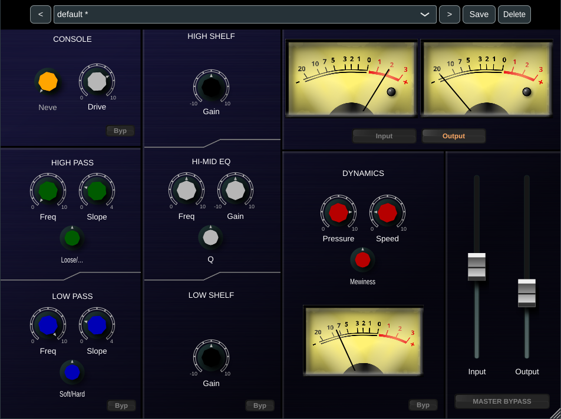
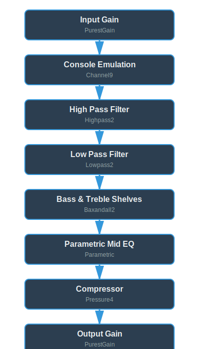

\begin{titlepage}
\centering
\vspace*{3cm}

\includegraphics[width=0.7\textwidth]{../pics/screenshot.png}

\vspace{2cm}

{\Huge\bfseries\color{blue!80!black} NineStrip}

\vspace{1cm}

{\Large User Manual}

\vspace{0.5cm}

{\normalsize\textit{Channel Strip Processing}}

\vfill

{\color{blue!60}\rule{0.8\textwidth}{2pt}}

\vspace{0.5cm}

{\large Version 0.0.1}

\vspace{1cm}

{\small Built with AirWindows DSP}

\vspace{2cm}
\end{titlepage}

\newpage
\newpage
\tableofcontents
\newpage


# Introduction

NineStrip is a JUCE-based channel strip plugin that implements a comprehensive signal processing chain using AirWindows DSP algorithms. The plugin consolidates multiple processing stages into a unified interface, providing a complete channel strip solution suitable for a wide range of mixing applications.

The DSP foundation of this plugin comes from Chris Johnson's AirWindows collection - a well-regarded library of audio processors known for their sonic characteristics and computational efficiency. By integrating these processors into a single plugin architecture, NineStrip offers a cohesive processing environment with consistent routing and control.

The signal chain implements a conventional channel strip topology: input gain staging, console emulation with harmonic saturation, high-pass and low-pass filtering, three-band EQ (bass and treble shelves with parametric mid control), dynamic range compression, and output gain. Each processing stage can be independently bypassed, allowing for flexible configuration based on source material requirements.

# Installation

## Linux

1. Download the `NineStrip.vst3` bundle
2. Copy to your VST3 directory:
   ```bash
   mkdir -p ~/.vst3
   cp -r NineStrip.vst3 ~/.vst3/
   ```
3. Rescan plugins in your DAW

**Alternative system-wide installation:**
```bash
sudo cp -r NineStrip.vst3 /usr/lib/vst3/
```

## macOS

1. Download the `NineStrip.vst3` bundle
2. Copy to one of these locations:
   ```
   ~/Library/Audio/Plug-Ins/VST3/        (user)
   /Library/Audio/Plug-Ins/VST3/         (system)
   ```
3. Rescan plugins in your DAW

## Windows

1. Download the `NineStrip.vst3` bundle
2. Copy to your VST3 directory:
   ```
   C:\Program Files\Common Files\VST3\
   ```
3. Rescan plugins in your DAW

# Operation

The NineStrip interface is organized into a single-window layout divided into three main columns:

**Left Column - Filtering & Console:**

- **Console** section (top) - Console modeling with Drive control and bypass
- **Filters** section
  - **High Pass** section - Frequency, Slope, and Loose/Tight controls
  - **Low Pass** section - Frequency, Slope, and Soft/Hard controls
  - Bypass

**Center Column - Equalization:**

- **High Shelf** - Gain control 
- **Hi-Mid EQ** - Parametric mid band with Frequency, Gain, and Q controls
- **Low Shelf** - Gain control
- Bypass

**Right Column - Metering & Dynamics:**

- Dual VU meters (top) - Switchable between Input and Output monitoring
- **Dynamics** section 
  - Compressor with Pressure, Speed, and Mewiness controls
  - Gain reduction meter
  - Bypass
- **Input/Output Faders** - Vertical faders for input and output gain staging
- **Master Bypass**

**Presets Bar:**

- Dropdown selector
- Navigation arrows
- Save/Delete buttons

The interface uses color-coded knobs for quick visual identification: orange for console, green for high pass, blue for low pass, and white/grey for EQ and dynamics controls.



# Signal Chain




# NineStrip Functional Blocks

## Airwindows Channel9

Based on Airwindows Channel9, this processing chain adds analog warmth, subtle harmonic enhancement, and the sonic characteristics of classic recording consoles to your signal.

### Console Type
Select from five distinct console models, each calibrated to emulate the sonic characteristics of different analog desks:

- **Neve** - Extended high-frequency response with a slightly darker, fuller low end. Features the most open top-end extension (rolling off around 30kHz) with minimal low-frequency roll-off. Ideal for adding depth and a "large format hit record" quality.
- **API** - Clean and punchy character with slightly less extended highs than Neve. Maintains excellent clarity while adding subtle analog warmth. Well-suited for drums, vocals, and instruments requiring presence.
- **SSL** - Large-format console sound with high-frequency roll-off closer to the audible range (around 24-26kHz). Reflects the behavior of consoles with multiple processing stages. Delivers a polished, professional sound associated with modern productions.
- **TEAC** - Budget mixer character with more aggressive low and high-frequency roll-off within the audible range. Provides distinctive coloration useful for lo-fi aesthetics, electronic music, and intentional frequency sculpting. Slightly darker overall tonality.
- **Mackie** - Prosumer mixer model, brighter than TEAC but with similar limited frequency response. Tighter low-end control and characteristic midrange presence. Useful for shaping synthesizers and adding "budget mixer" vibe to electronic productions.

### Drive
Controls the amount of saturation applied to the signal, ranging from 0% to 200%.

0-5: Gradually introduces Spiral saturation - a clean, smooth harmonic enhancement that adds body without excessive thickness. The processing crossfades from dry to fully saturated, preserving transient information.

5-10: Crossfades from Spiral into Density mode, adding fuller harmonic thickness characteristic of traditional console channels. Higher settings produce more pronounced saturation and "bigness."

### Processing Architecture

Channel9 employs a sophisticated multi-stage processing chain:

1. **Ultrasonic Filtering** - Sample-rate-aware filtering that eliminates aliasing artifacts while maintaining a subtle presence lift in the upper frequencies, characteristic of high-end analog consoles
2. **Analog-Style High-Pass** - Subtle filtering modeling capacitor behavior in analog circuits, preventing subsonic buildup
Saturation Stage - Smooth harmonic enhancement using Spiral (clean) and Density (thick) algorithms
3. **Slew Clipping** - Emulates op-amp speed limitations, adding realistic analog behavior to transients

Each console type adjusts the high-pass filter characteristics, slew clipping thresholds, and ultrasonic filter response to match the sonic signature of the modeled hardware.

\pagebreak

## Airwindows Highpass2

The Highpass2 section provides sophisticated high-pass filtering based on AirWindows Highpass2. This multi-pole IIR (Infinite Impulse Response) filter removes low-frequency content while offering unique tonal characteristics through its interleaved filtering approach.

### Highpass

Controls the cutoff frequency of the high-pass filter, progressively removing low-frequency content as the value increases. At zero, the filter has minimal effect; at maximum, aggressive low-frequency attenuation is applied.

**Unique Characteristic**: Unlike conventional high-pass filters, Highpass2 employs an interleaved IIR filtering technique that simultaneously reduces extreme high-frequency content. This creates a more natural, analog-like quality by softening the uppermost frequencies while filtering lows, resulting in a gentler overall frequency response.

### Loose/Tight

Adjusts the filter's response characteristics based on signal amplitude, ranging from -10 (Loose) to +10 (Tight). This control shapes how the filter behaves in relation to the input signal level.

**Tight (positive values)**: The filter responds more aggressively to louder signals. Increases filtering on high-level material while maintaining more low-frequency content on quiet signals. Creates a dynamic response where the filter "clamps down" more on strong transients and loud passages.

**Center (0.0)**: Neutral response where the filter behaves consistently regardless of signal level.

**Loose (negative values)**: The filter responds more to quiet signals. Increases filtering on low-level material while allowing louder signals to retain more low-frequency content. This can help control subsonic rumble and noise floor issues while preserving punch in prominent elements.

**Note**: Extreme settings (full Loose or full Tight) can produce experimental behaviors, particularly with very quiet signals. For standard mixing applications, moderate settings typically yield the most musical results.

### Poles

Determines the filter slope steepness by controlling the number of cascaded filter stages, ranging from 0 to 4.0.

- **0.0-1.0**: Single-pole filtering (6 dB/octave) with the gentlest slope and most transparent character
- **1.0-2.0**: Two-pole filtering (12 dB/octave) providing moderate attenuation
- **2.0-3.0**: Three-pole filtering (18 dB/octave) for more aggressive low-frequency removal
- **3.0-4.0**: Four-pole filtering (24 dB/octave) delivering the steepest slope and most pronounced effect

Each additional pole stage increases the filter's steepness while introducing more of Highpass2's characteristic high-frequency softening. The control uses progressive wet/dry blending between stages, allowing smooth transitions and partial pole values for fine-tuning.

### Processing Architecture

Highpass2 utilizes an interleaved IIR filter design that alternates between two sets of filter coefficients on successive samples. This approach provides:

- Natural-sounding high-pass filtering with reduced digital artifacts
- Subtle high-frequency roll-off that mimics analog behavior
- Dynamic response control through the Loose/Tight parameter
- Scalable filter slope via cascaded stages

The interleaved processing creates a softer, more organic quality compared to standard digital high-pass filters, making it particularly effective for transparent low-frequency control without harsh resonances or phase artifacts.

\pagebreak

## Airwindows Lowpass2

The Lowpass2 section provides sophisticated low-pass filtering based on AirWindows Lowpass2. This multi-pole IIR (Infinite Impulse Response) filter removes high-frequency content while offering dynamic amplitude-dependent filtering characteristics through its interleaved processing approach.

### Lowpass

Controls the cutoff frequency of the low-pass filter, progressively removing high-frequency content as the value increases. At zero, the filter has minimal effect; at maximum, aggressive high-frequency attenuation is applied.

**Unique Characteristic**: Unlike conventional low-pass filters, Lowpass2 employs an interleaved IIR filtering technique that preserves extreme high-frequency content. Frequencies near the Nyquist limit (e.g., 22kHz at 44.1kHz sample rate) are minimally affected, providing enhanced clarity in the retained frequency range while still smoothly rolling off mid-high frequencies.

### Soft/Hard

Adjusts the filter's dynamic response characteristics based on signal amplitude, ranging from -10 (Soft) to +10 (Hard). This control creates amplitude-dependent filtering behavior on a sample-by-sample basis, producing effects distinctly different from traditional envelope followers.

**Soft (negative values)**: The filter rolls off more aggressively on louder signals. High-level material experiences increased filtering while quieter sounds retain more high-frequency content. Creates a smoothing effect where transients and peaks are mellowed, resulting in a "softer" overall character. Useful for taming harsh high-frequency peaks while preserving detail in quieter passages.

**Center (0.0)**: Neutral response where the filter behaves consistently regardless of signal level.

**Hard (positive values)**: The filter rolls off more aggressively on quieter signals. Low-level material experiences increased filtering while louder sounds break through with more high-frequency content. Creates a dynamic "opening" effect where transients and peaks punch through brighter. Can produce characteristic artifacts including spiky, crunchy textures on complex material, particularly effective for creative sound design applications.

**Sound Design Applications**: Extreme Hard settings can create unique effects on noise and complex signals, producing wind-like textures, dynamic crackle, and movement-based filtering. The sample-level processing creates textures unachievable with traditional envelope-controlled filters.

### Poles

Determines the filter slope steepness by controlling the number of cascaded filter stages, ranging from 0 to 4.0.

**0.0-1.0**: Single-pole filtering (6 dB/octave) with the gentlest slope, offering subtle high-frequency roll-off and maximum transparency

**1.0-2.0**: Two-pole filtering (12 dB/octave) providing moderate attenuation with a balanced character

**2.0-3.0**: Three-pole filtering (18 dB/octave) for more pronounced low-pass effect

**3.0-4.0**: Four-pole filtering (24 dB/octave) delivering the steepest slope and most dramatic filtering

Each additional pole stage increases the filter's steepness and intensifies the Soft/Hard control's effect. The control uses progressive wet/dry blending between stages, allowing smooth transitions and partial pole values for fine-tuning. Higher pole counts amplify the dynamic filtering behaviors, making the Soft/Hard parameter more pronounced.

### Processing Architecture

Lowpass2 utilizes an interleaved IIR filter design that alternates between two sets of filter coefficients on successive samples. This approach provides:

- Smooth low-pass filtering with preservation of ultra-high frequencies
- Dynamic amplitude-dependent filtering operating at the sample level
- More organic, less "digital" sound quality compared to standard filters
- Scalable filter slope via cascaded stages
- Creative sound design potential through extreme parameter combinations

The interleaved processing creates a unique tonal character that combines traditional filtering with dynamic response characteristics. The Soft/Hard control's sample-level operation produces averaging effects that distinguish it from envelope-based filtering, enabling both subtle mixing applications and extreme creative effects.

\pagebreak

## Airwindows Baxandall2

The High and Low Shelf sections provide broad tonal shaping based on AirWindows Baxandall2. This implementation of the classic Baxandall shelving EQ topology features exceptionally wide Q values and minimal phase shift characteristics.

### High Shelf (Treble)

Applies broad, gentle shelving boost or cut to high frequencies.

**Range:** -10 to +10

**Frequency Response Characteristics:**

- Uses an exceptionally wide Q value (0.4) creating a very gentle slope
- The shelving curve continues rising or falling well beyond 20kHz
- Center frequency varies dynamically based on gain amount (approximately 10-12kHz region)
- Minimal phase distortion due to Baxandall topology mathematics

**Sound Character:**

- **Negative values:** Progressive darkening with smooth high-frequency roll-off
- **Zero:** Unity gain, no tonal change
- **Positive values:** Progressive brightening with enhanced air and clarity

The extended frequency response beyond the audible range contributes to a natural, transparent sound quality. Adjustments affect a massive portion of the frequency spectrum due to the gentle slope.

### Low Shelf (Bass)

Applies broad, gentle shelving boost or cut to low frequencies.

**Range:** -10 to +10

**Frequency Response Characteristics:**

- Uses an exceptionally wide Q value (0.2) creating a very gentle slope
- The shelving curve continues affecting frequencies well below 20Hz
- Center frequency varies dynamically based on gain amount (approximately 60-100Hz region)
- Minimal phase distortion due to Baxandall topology mathematics

**Sound Character:**

- **Negative values:** Progressive thinning with smooth low-frequency reduction
- **Zero:** Unity gain, no tonal change
- **Positive values:** Progressive addition of warmth, body, and weight

The gentle slope means the effect extends deep into sub-bass territory and affects a large portion of the frequency spectrum.

### Interaction Between Controls

**Combined Adjustments:**

- Both controls boosted: Creates mid-scooped frequency response ("smiley face" curve)
- Both controls cut: Creates mid-range emphasis
- One boosted, one cut: Tilts overall frequency balance toward the boosted range

The extremely wide Q values mean these interactions create broad, gentle tonal shifts rather than narrow frequency sculpting. The mathematical relationship between the shelves ensures complementary behavior across the frequency spectrum.

### Processing Architecture

Baxandall2 is a clean implementation of the classic Baxandall shelving EQ topology without analog modeling or saturation. Key characteristics:

**Gentle Shelving Curves:** Uses very wide Q values (treble: 0.4, bass: 0.2) creating smooth, musical slopes rather than sharp parametric-style curves.

**Extended Response:** The shelving curves extend well beyond the audible range, contributing to a transparent, natural tonal character.

**Minimal Phase Impact:** Large gain adjustments can be made without significantly affecting transient response or stereo imaging.

**Adaptive Frequency:** The center frequency of each shelf automatically adjusts based on gain setting to maintain optimal response curves.

\pagebreak

## Airwindows Parametric

The Hi-Mid EQ section provides precise frequency sculpting based on AirWindows Parametric. This implementation uses a "Stacked Biquad with Reversed Neutron Flow" architecture, employing three cascaded biquad filters with nonlinear characteristics for musical-sounding frequency adjustment.

### Frequency

Controls the center frequency of the parametric band.

**Range:** 0 to 10 

**Frequency Coverage:** Approximately 600 Hz to 7000 Hz

The frequency calculation uses a cubic curve, providing finer control in lower frequencies and broader steps in higher frequencies. This nonlinear scaling mirrors the logarithmic nature of human hearing.

### Gain

Controls the amount of boost or cut applied at the selected frequency.

**Range:** -10 to +10 

**Sound Character:**

- **Negative values (-10 to 0):** Progressive attenuation at the selected frequency, creating a notch that can remove unwanted resonances or reduce problematic frequency buildups
- **Zero (0):** No gain change, band is effectively bypassed
- **Positive values (0 to +10):** Progressive boost at the selected frequency, enhancing presence and emphasizing desired tonal characteristics

**Gain Behavior:** When gain exceeds unity (positive values), the algorithm applies additional gain multiplication, creating more pronounced effects at higher settings. This nonlinear gain structure provides subtle adjustments at low settings and increasingly bold tonal shaping at higher values.

### Q (Resonance)

Controls the bandwidth of the parametric filter, determining how narrow or wide the affected frequency range is.

**Range:** 0 to 10

**Bandwidth Characteristics:**

- **Lower values (0-3):** Wider bandwidth affecting a broader frequency range. Creates gentler, more musical curves suitable for general tonal shaping
- **Medium values (3-7):** Moderate bandwidth providing balanced control for typical mixing tasks
- **Higher values (7-10):** Narrower bandwidth creating more surgical, precise frequency targeting. Useful for notching specific problem frequencies or adding focused presence

**Dynamic Q Behavior:** The resonance calculation incorporates both the gain setting and the frequency, creating a frequency-dependent Q that naturally widens at higher frequencies and narrows at lower frequencies. This mimics the behavior of classic analog parametric EQs

### Processing Architecture

The Hi-Mid EQ uses AirWindows' cascaded biquad filtering design:

**Three-Stage Filter:** Uses three biquad filters in series with different Q values, creating steeper slopes and more complex frequency response than typical single-stage parametric EQs.

**Nonlinear Processing:** Signal-dependent gain modulation prevents harsh digital artifacts, particularly at extreme boost or cut settings, adding subtle harmonic enhancement for a more analog character.

**Parallel Summing:** The filtered signal is added to the original signal rather than replacing it, preserving the source material's integrity while adding the equalized component for more transparent, musical adjustments.

\pagebreak

## DC Blocker

The DC Blocker removes DC offset (unwanted zero-frequency content) from the audio signal. DC offset can occur from analog-to-digital conversion, certain processing algorithms, or accumulation through a signal chain, and can cause issues with headroom, compression behavior, and speaker damage in extreme cases.

### Operation

The DC blocker operates transparently in the background with no user controls. It processes both channels identically using a high-pass filter with a 5 Hz cutoff frequency.

### Processing Architecture

**High-Pass Filter Design:** Implements a first-order IIR high-pass filter specifically tuned to remove only DC and near-DC content while leaving the audible frequency range completely untouched.

**5 Hz Cutoff:** The extremely low cutoff frequency (5 Hz) ensures that even the deepest bass frequencies remain unaffected. Musical content starts well above this threshold, making the filtering completely transparent.

**Sample Rate Adaptive:** The filter coefficients automatically adjust based on the project sample rate, maintaining consistent behavior at 44.1kHz, 48kHz, 96kHz, and higher sample rates.

**Independent Stereo Processing:** Each channel maintains its own filter state, preventing any inter-channel artifacts while efficiently removing DC offset from both left and right signals.

This processing stage runs continuously and requires no configuration, silently protecting your signal chain from DC offset issues.


\pagebreak

## Airwindows Pressure4

The Dynamics section provides compression based on AirWindows Pressure4. This unique compressor design uses a "µ" (mu) style algorithm that operates fundamentally differently from traditional VCA, FET, or optical compressors, offering organic, musical compression with distinctive tonal characteristics.

### Pressure

Controls the compression threshold and intensity.

**Range:** 0 to 10 

**Compression Characteristics:**

- **0:** No compression applied, signal passes through unaffected
- **Low values (0-3):** Gentle compression with subtle dynamic control. Transparent gain reduction suitable for mix bus applications
- **Medium values (3-7):** Moderate compression with more pronounced dynamic control. Audible gain reduction while maintaining naturalness
- **High values (7-10):** Aggressive compression with significant gain reduction. Creates heavily controlled, upfront sound with potential for character and coloration

Automatic makeup gain is applied as compression increases, maintaining consistent output levels.

### Speed

Controls the attack and release characteristics of the compressor.

**Range:** 0 to 10

**Time Response Characteristics:**

- **Low values (0-3):** Very slow attack and release. Compression develops gradually and releases slowly, preserving transients and creating gentle, program-dependent control. Suitable for maintaining natural dynamics and soundstage
- **Medium values (3-7):** Moderate attack and release speeds. Balanced response that catches transients while maintaining some natural dynamics
- **High values (7-10):** Extremely fast attack and release. Compression responds almost instantaneously to signal changes, creating aggressive, pumping characteristics. Can produce artifacts on complex material but useful for maximum loudness and upfront presence


### Mewiness (µ)

Controls the compression ratio behavior and character, ranging from negative µ (mu) through neutral to positive µ.

**Range:** -10 to +10 

**Character Variations:**

**Negative values (-10 to 0):**

- Creates "negative µ" compression behavior
- Preserves attack transients while still compressing
- Produces effects similar to parallel compression or "New York compression"
- Lower negative values create more pronounced transient preservation
- Useful for maintaining punch and presence while controlling overall dynamics

**Zero (0):**

- Standard compression behavior
- Linear ratio response
- Most similar to traditional compressor operation

**Positive values (0 to +10):**

- Creates "positive µ" (variable-mu) compression behavior
- Increases ratio as compression depth increases
- Harder compression on peaks, creating a "squashing" effect
- Higher positive values create more extreme ratio changes
- Useful for aggressive limiting and maximum loudness applications

### Processing Architecture

Pressure4 employs several techniques that distinguish it from conventional compressors:

**Dual-Sample Processing:** Uses alternating compression coefficients that flip on each sample, reducing artifacts and creating smoother compression behavior, particularly at extreme settings.

**Linked Stereo Operation:** Analyzes both channels together and applies identical gain reduction to preserve stereo imaging and prevent image shifts during compression.

**Program-Dependent Behavior:** Attack and release speeds continuously adjust based on input signal level and compression state, responding organically to musical content.

**Analog-Style Saturation:** Final stage uses soft clipping to prevent digital overs while allowing high compression amounts. This contributes to the "warm" character even at moderate settings.

**Sample Rate Compensation:** Timing calculations automatically adjust for sample rate, ensuring consistent compression behavior regardless of project settings.

**Gain Reduction Metering:** Visual feedback of compression activity is provided through the gain reduction meter in the interface.

\pagebreak

## Airwindows PurestGain

The Input and Output Gain controls provide precision gain adjustment based on AirWindows PurestGain, designed for transparent level changes with minimal digital artifacts.

### Gain Range

Both Input and Output Gain controls operate identically.

**Range:** -40 dB to +40 dB

**Gain Characteristics:**

- **Negative values (-40 to 0 dB):** Progressive attenuation of signal level
- **Zero (0 dB):** Unity gain, no level change
- **Positive values (0 to +40 dB):** Progressive boost of signal level

### Processing Architecture

PurestGain is designed as a minimal-impact gain stage with several optimizations for transparency:

**Single-Stage Processing:** Performs gain adjustment as a single multiply operation, minimizing cumulative artifacts compared to multi-stage gain plugins.

**True Bypass at Unity:** When set to 0 dB, the signal passes through completely unprocessed, preserving bit-transparency.

**Floating-Point Noise Shaping:** Applies specialized dithering to the 32-bit floating-point audio bus to minimize quantization artifacts, particularly important when cascading multiple gain stages.

**Smooth Parameter Changes:** Uses an adaptive interpolation system to eliminate zipper noise (audible clicks from rapid parameter adjustments) while maintaining responsive control.

The sonic benefits are most apparent when using multiple instances in series, making very small gain adjustments, or processing material with extended reverb tails and quiet ambience.
 
# Presets

NineStrip includes a comprehensive preset management system that allows you to save, recall, and organize complete channel strip configurations.

## Preset Browser

The preset browser is located at the top of the plugin interface and consists of:

- **Preset Dropdown Menu:** Displays the current preset name and provides access to all available presets
- **Previous/Next Arrows:** Navigate sequentially through the preset list
- **Save Button:** Opens the save preset dialog
- **Delete Button:** Removes the currently selected preset

## Using Presets

**Loading a Preset:**
1. Click the preset dropdown menu to view all available presets
2. Click on a preset name to load it
3. Alternatively, use the arrow buttons to navigate through presets sequentially

**Saving a Preset:**
1. Configure the channel strip parameters to your desired settings
2. Click the Save button
3. Enter a descriptive name for your preset
4. Click OK to save

**Deleting a Preset:**
1. Load the preset you wish to delete
2. Click the Delete button
3. Confirm the deletion when prompted

## Preset Storage

Presets are stored as XML files in your system's standard plugin preset location:

**Linux:**
```
~/.config/NineStrip/Presets/
```

**macOS:**
```
~/Library/Audio/Presets/NineStrip/
```

**Windows:**
```
%APPDATA%\NineStrip\Presets\
```


# Credits & Acknowledgments

- **JUCE Framework**: Jules Storer and Raw Material Software Limited  
  [https://juce.com](https://juce.com)

- **AirWindows**: Chris Johnson  
  [https://www.airwindows.com](https://www.airwindows.com)
  
- **3D Knob LnF**:  
  [https://github.com/SoundDevelopment/3D_knob_lnf](https://github.com/SoundDevelopment/3D_knob_lnf)

# Contact & Support

- **GitHub**: https://github.com/blablack/NineStrip/
- **Issues**: https://github.com/blablack/NineStrip/issues

---

*NineStrip - Channel Strip Processing*
