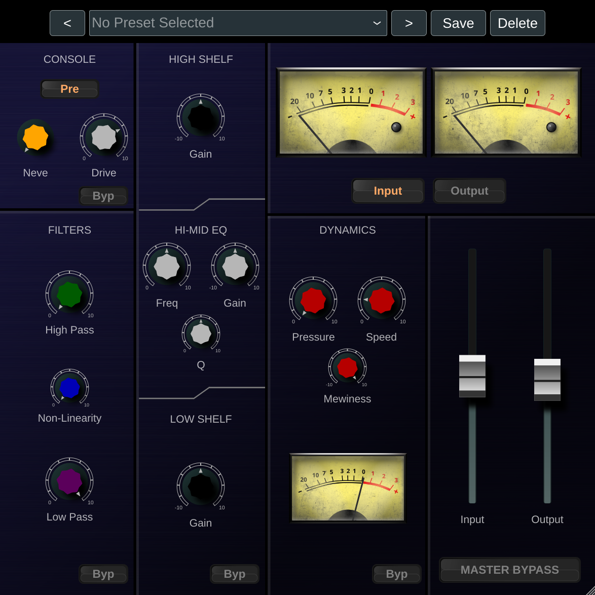
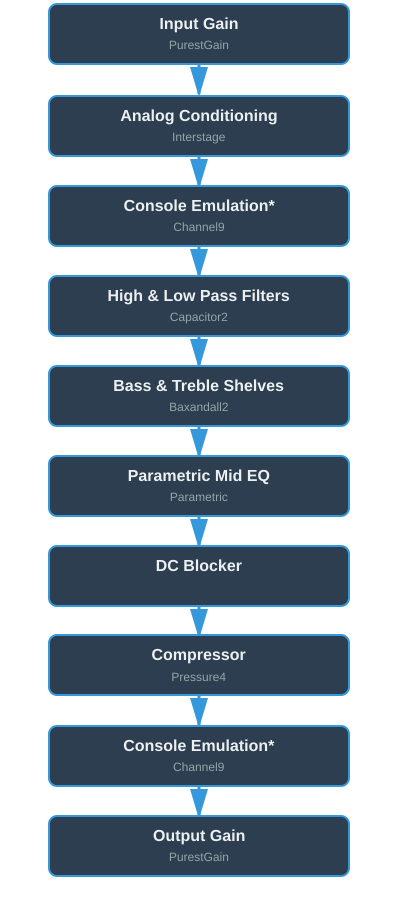

\begin{titlepage}
\centering
\vspace*{3cm}

\includegraphics[width=0.7\textwidth]{../pics/screenshot.png}

\vspace{2cm}

{\Huge\bfseries\color{blue!80!black} NineStrip}

\vspace{1cm}

{\Large User Manual}

\vspace{0.5cm}

{\normalsize\textit{Channel Strip Processing}}

\vfill

{\color{blue!60}\rule{0.8\textwidth}{2pt}}

\vspace{0.5cm}

{\large Version 0.1.0}

\vspace{1cm}

{\small Built with AirWindows DSP}

\vspace{2cm}
\end{titlepage}

\newpage
\newpage
\tableofcontents
\newpage


# Introduction

NineStrip is a JUCE-based channel strip plugin that implements a comprehensive signal processing chain using AirWindows DSP algorithms. The plugin consolidates multiple processing stages into a unified interface, providing a complete channel strip solution suitable for a wide range of mixing applications.

The DSP foundation of this plugin comes from Chris Johnson's AirWindows collection - a well-regarded library of audio processors known for their sonic characteristics and computational efficiency. By integrating these processors into a single plugin architecture, NineStrip offers a cohesive processing environment with consistent routing and control.

The signal chain implements a conventional channel strip topology:
- Input gain staging
- Console emulation with harmonic saturation
- High-pass and low-pass filtering
- Three-band EQ — bass and treble shelves with a parametric mid
- Dynamic range compression
- Output gain

Each processing stage can be independently bypassed, allowing for flexible configuration based on source material requirements.

# Installation

NineStrip is available in the following formats:
- **VST3 Plugin** - For use within digital audio workstations (DAWs)
- **LV2 Plugin** - For use within LV2-compatible DAWs (Linux only)
- **AU Plugin** - For use within AU-compatible DAWs (macOS only)
- **Standalone Application** - For independent audio processing


## Linux

Download and extract `NineStrip-Linux.tar.gz`:
```bash
tar -xzf NineStrip-Linux.tar.gz
cd NineStrip
```

### VST3 Plugin

1. Copy to your VST3 directory:
   ```bash
   cp -r NineStrip.vst3 ~/.vst3/
   ```
2. Rescan plugins in your DAW

**Alternative system-wide installation:**
```bash
sudo cp -r NineStrip.vst3 /usr/lib/vst3/
```

### LV2 Plugin

1. Copy to your LV2 directory:
   ```bash
   cp -r NineStrip.lv2 ~/.lv2/
   ```
2. Rescan plugins in your DAW

**Alternative system-wide installation:**
```bash
sudo cp -r NineStrip.lv2 /usr/lib/lv2/
```

### Standalone Application

Run directly:
```bash
./NineStrip
```


## macOS

Download and extract `NineStrip-macOS.zip`, then remove the macOS quarantine flag from all bundles before installing. macOS Gatekeeper blocks unsigned plugins with a "plugin is damaged" error. Until this plugin is code-signed, run the following in Terminal from the extracted folder:

```bash
xattr -rd com.apple.quarantine NineStrip.vst3
xattr -rd com.apple.quarantine NineStrip.component
xattr -rd com.apple.quarantine NineStrip.app
```

### VST3 Plugin

1. Copy to one of these locations:
   ```
   ~/Library/Audio/Plug-Ins/VST3/        (user)
   /Library/Audio/Plug-Ins/VST3/         (system)
   ```
2. Rescan plugins in your DAW

### AU Plugin

1. Copy to one of these locations:
   ```
   ~/Library/Audio/Plug-Ins/Components/        (user)
   /Library/Audio/Plug-Ins/Components/         (system)
   ```
2. Force macOS to re-register the component:
   ```bash
   killall -9 AudioComponentRegistrar
   ```
3. Rescan plugins in your DAW

### Standalone Application

Drag `NineStrip.app` to your Applications folder, or run directly from the extracted folder.


## Windows

Download and extract `NineStrip-Windows.zip`.

### VST3 Plugin

1. Copy `NineStrip.vst3` to your VST3 directory:
   ```
   C:\Program Files\Common Files\VST3\
   ```
2. Rescan plugins in your DAW

### Standalone Application

Run `NineStrip.exe` directly or place it in a convenient location (e.g., Program Files).


# Using the Standalone Application

The standalone version of NineStrip operates identically to the plugin version but runs as an independent application, allowing you to process audio without a DAW.


## Audio Configuration

On first launch, configure your audio interface:

1. Click the settings/options button (typically in the menu or toolbar)
2. Select **Audio/MIDI Settings** or **Preferences**
3. Configure:
   - **Audio Device:** Select your audio interface
   - **Sample Rate:** Choose appropriate sample rate (44.1kHz, 48kHz, etc.)
   - **Buffer Size:** Adjust for balance between latency and performance
   - **Input Channels:** Select your input source
   - **Output Channels:** Select your output destination

## Typical Use Cases

**Hardware Processing:**
- Connect external instruments or microphones to your audio interface
- Process signals through NineStrip in real-time
- Monitor or record the processed output

**File Processing:**
- Use your DAW's audio routing to send tracks through the standalone application
- Process stems or individual tracks outside your DAW session

**Live Performance:**
- Use as a vocal or instrument processor during live performances
- Benefit from low-latency processing with appropriate buffer size settings

## Standalone vs Plugin

The standalone application offers identical processing quality and controls as the VST3 plugin. The main differences are:

- **Plugin:** Runs inside a DAW, integrates with your session, supports automation
- **Standalone:** Runs independently, processes audio in real-time, useful for hardware processing or live use

All presets are shared between plugin and standalone versions.

# Operation

The NineStrip interface is organised into a single-window layout divided into three main columns:

**Left Column - Filtering & Console:**

- **Console** section (top)
  - Pre/Post button
  - Console modelling 
  - Drive control
  - Bypass
- **Filters** section
  - High Pass
  - Non-Linearity 
  - Low Pass
  - Bypass

**Center Column - Equalization:**

- **High Shelf** - Gain control 
- **Hi-Mid EQ** - Parametric mid band with Frequency, Gain, and Q controls
- **Low Shelf** - Gain control
- Bypass

**Right Column - Metering & Dynamics:**

- Dual VU meters (top) - Switchable between Input and Output monitoring
- **Dynamics** section 
  - Compressor with Pressure, Speed, and Mewiness controls
  - Gain reduction meter
  - Bypass
- **Input/Output Faders** - Vertical faders for input and output gain staging
- **Master Bypass**

**Presets Bar:**

- Dropdown selector
- Navigation arrows
- Save/Delete buttons

The interface uses color-coded knobs for quick visual identification: orange for console, green for high pass, blue for low pass, and white/grey for EQ and dynamics controls.



# Signal Chain

The diagram below shows the fixed processing order. Understanding the signal flow is useful when making decisions about gain staging, filter placement, and the Pre/Post console position.




CHANNEL9 is instantiated once but runs at either the Pre (right after Interstage) or Post (right before Output) position depending on the 'Pre/Post' parameter.
Both slots are never active simultaneously.


# NineStrip Functional Blocks

## Airwindows Interstage

Based on Airwindows Interstage, this zero-parameter processor emulates the natural frequency shaping and slew-rate limitations of analog circuitry. Interstage applies subtle conditioning to prevent excessively digital bass and treble characteristics without introducing distortion, saturation, or gain changes.

### Operation

Interstage operates transparently in the background with no user controls. It processes both channels identically, applying conditioning only when the signal exhibits characteristics that would not naturally occur in analog hardware.

**Transparency by Design:** On naturally balanced audio, Interstage may produce no audible change. The processing only engages when confronted with extreme digital characteristics—unnaturally aggressive transients or excessive slew rates.

**Non-Destructive Processing:** Interstage does not alter gain staging, add harmonic distortion, or compress dynamics. Peaks may increase slightly on heavily limited material as subsonic energy gets reorganised—this is normal analog-like behaviour.

### Bass Conditioning

Reshapes low frequencies in a manner characteristic of capacitor-coupled analog circuits. Rather than removing bass content, Interstage subtly reorganizes subsonic and deep bass frequencies while maintaining extended low-frequency response. The result feels more controlled and analog-like without losing depth or impact.

### Treble Management

Restricts extreme treble slew rates based on overall signal energy. Normal audio passes through with full clarity and brightness. When confronted with unnaturally fast transients, Interstage automatically contains the most extreme high-frequency swings, creating the characteristic sound of real electronic components with finite speed limitations.

**Signal-Dependent Response:** Louder, more energetic signals trigger progressively more high-frequency containment. Quiet passages retain full brightness. This mimics how analog components naturally respond to varying signal levels.


\pagebreak


## Airwindows Channel9

Based on Airwindows Channel9, this processing chain adds analog warmth, subtle harmonic enhancement, and the sonic characteristics of classic recording consoles to your signal.

### Console Type
Select from five distinct console models, each calibrated to emulate the sonic characteristics of different analog desks:

- **Neve** - Extended high-frequency response with a slightly darker, fuller low end. Features the most open top-end extension (rolling off around 30kHz) with minimal low-frequency roll-off. Ideal for adding depth and a "large format hit record" quality.
- **API** - Clean and punchy character with slightly less extended highs than Neve. Maintains excellent clarity while adding subtle analog warmth. Well-suited for drums, vocals, and instruments requiring presence.
- **SSL** - Large-format console sound with high-frequency roll-off closer to the audible range (around 24-26kHz). Reflects the behaviour of consoles with multiple processing stages. Delivers a polished, professional sound associated with modern productions.
- **TEAC** - Budget mixer character with more aggressive low and high-frequency roll-off within the audible range. Provides distinctive coloration useful for lo-fi aesthetics, electronic music, and intentional frequency sculpting. Slightly darker overall tonality.
- **Mackie** - Prosumer mixer model, brighter than TEAC but with similar limited frequency response. Tighter low-end control and characteristic midrange presence. Useful for shaping synthesizers and adding "budget mixer" vibe to electronic productions.

### Drive
Controls the amount of saturation applied to the signal.

**Range:** 0 to 10 

0-5: Gradually introduces a clean, transparent saturation - a clean, smooth harmonic enhancement that adds body without excessive thickness. The processing crossfades from dry to fully saturated, preserving transient information.

5-10: Crossfades into a thicker saturation, adding fuller harmonic thickness characteristic of traditional console channels. Higher settings produce more pronounced saturation and "bigness."

### Processing Architecture

Channel9 employs a multi-stage processing chain:

1. **Ultrasonic Filtering** — Rather than a clean brick-wall cut, the filter introduces a slight presence lift just before it rolls off — the same characteristic rise you get from real analog hardware as it approaches the edge of its frequency range. The filter is also sample-rate aware: if the rolloff point would fall below the Nyquist frequency of the current session (half the sample rate), it disengages entirely rather than applying a filter in the wrong place.

2. **Analog-Style High-Pass** — Uses the same capacitor-modelling approach as Capacitor2, preventing subsonic buildup through filtering that behaves more like a real component than a fixed digital cutoff.

3. **Saturation Stage** — From 0–5, the Drive control crossfades into a clean, transparent saturation that preserves transient detail. From 5–10, it transitions into a thicker, fuller harmonic character that adds weight and density to the signal. The saturation stage also acts as the anchor point for aliasing control — the ultrasonic filter cleans up anything the saturation introduces before it reaches the audible range.

4. **Slew Clipping** — Emulates the speed limitations of op-amps, adding realistic analog behaviour to transients. The threshold is calibrated per console type: expensive large-format desks clip gently, while budget mixers — built from cheaper op-amps — clip more aggressively.

Each console type adjusts the high-pass filter characteristics, slew clipping thresholds, and ultrasonic filter response to match the sonic signature of the modelled hardware.


\pagebreak


## Airwindows Capacitor2

Based on Airwindows Capacitor2, the Filters section provides high-pass and low-pass filtering that simulates the behaviour of barium titanate ceramic capacitors — components whose capacitance value drops under voltage pressure. Unlike conventional digital filters, Capacitor2 modulates its cutoff frequency in response to the signal itself, producing an organic, analog-like character that changes with the music.

### High Pass

Controls the cutoff frequency of the high-pass filter, removing low-frequency content as the value increases. At zero, the filter has minimal effect.

**Range:** 0 to +10

### Low Pass

Controls the cutoff frequency of the low-pass filter, removing high-frequency content as the value decreases. At ten, the filter has minimal effect.

**Range:** 0 to +10

### Non-Linearity

This is the defining feature of Capacitor2. It models the real-world behaviour of barium titanate capacitors, where the signal voltage itself modulates the cutoff frequency — asymmetrically, on a sample-by-sample basis.

- **At zero**: Behaves like a clean, transparent filter
- **Low values**: Adds a subtle analog flavour and slight transient boosting
- **High values**: Creates an expander-like effect where peak energy increases — not from dynamics processing, but from the frequency modulation itself. Can produce aggressive distortion and grinding at extreme settings

**Range:** 0 to +10

> **Note:** Non-Linearity increases the output level of the filtered signal. If you notice unexpected gain changes in the compressor or output stage, check this control first.


### Processing Architecture

Capacitor2 is built around the idea that a real capacitor doesn't behave the same way at every moment — its character shifts depending on the signal passing through it. The filter achieves this by continuously adjusting its cutoff frequency in response to the instantaneous signal level, rather than sitting at a fixed point the way a conventional digital filter does.

To avoid the harshness that rapid filter movement would normally cause, the processing cycles through six slightly different filter configurations on successive samples. This gives the overall response a smoothness and irregularity closer to analog hardware than a single static filter stage could achieve.

Parameter changes — including automation — are also smoothed internally, so adjusting the High Pass, Low Pass, or Non-Linearity controls never produces clicks or abrupt shifts.

\pagebreak

## Airwindows Baxandall2

The High and Low Shelf sections provide broad tonal shaping based on AirWindows Baxandall2. This implementation of the classic Baxandall shelving EQ topology features exceptionally wide Q values and minimal phase shift characteristics.

### High Shelf (Treble)

Applies broad, gentle shelving boost or cut to high frequencies.

**Range:** -10 to +10

**Frequency Response Characteristics:**

- Uses an exceptionally wide Q value (0.4) creating a very gentle slope
- The shelving curve continues rising or falling well beyond 20kHz
- Center frequency varies dynamically based on gain amount (approximately 10-12kHz region)
- Minimal phase distortion due to Baxandall topology mathematics

**Sound Character:**

- **Negative values:** Progressive darkening with smooth high-frequency roll-off
- **Zero:** Unity gain, no tonal change
- **Positive values:** Progressive brightening with enhanced air and clarity

The extended frequency response beyond the audible range contributes to a natural, transparent sound quality. Adjustments affect a massive portion of the frequency spectrum due to the gentle slope.

### Low Shelf (Bass)

Applies broad, gentle shelving boost or cut to low frequencies.

**Range:** -10 to +10

**Frequency Response Characteristics:**

- Uses an exceptionally wide Q value (0.2) creating a very gentle slope
- The shelving curve continues affecting frequencies well below 20Hz
- Center frequency varies dynamically based on gain amount (approximately 60-100Hz region)
- Minimal phase distortion due to Baxandall topology mathematics

**Sound Character:**

- **Negative values:** Progressive thinning with smooth low-frequency reduction
- **Zero:** Unity gain, no tonal change
- **Positive values:** Progressive addition of warmth, body, and weight

The gentle slope means the effect extends deep into sub-bass territory and affects a large portion of the frequency spectrum.

### Interaction Between Controls

**Combined Adjustments:**

- Both controls boosted: Creates mid-scooped frequency response ("smiley face" curve)
- Both controls cut: Creates mid-range emphasis
- One boosted, one cut: Tilts overall frequency balance toward the boosted range

The extremely wide Q values mean these interactions create broad, gentle tonal shifts rather than narrow frequency sculpting. The mathematical relationship between the shelves ensures complementary behaviour across the frequency spectrum.

### Processing Architecture

Baxandall2 is built around the observation that the most musical EQ moves rarely draw attention to themselves — they shift the overall tonal balance in a way that feels inevitable rather than processed. The classic Baxandall topology achieves this by using extremely wide shelving curves that start their influence far outside the audible range and arrive at the target frequency having already built momentum. There are no sharp edges, no audible pivot points — just a tilt in one direction or the other.

To keep this behaviour consistent across different gain settings, the center frequency of each shelf adjusts automatically as the gain changes, maintaining the optimal curve shape rather than letting the response skew as the control is pushed further. This means a subtle 2dB lift and a significant 10dB lift both feel proportionate and natural.

Because the slopes are so wide and gradual, large adjustments have minimal impact on phase response — transients stay intact, stereo imaging doesn't shift, and the changes read as tonal rather than corrective.


\pagebreak


## Airwindows Parametric

The Hi-Mid EQ section provides precise frequency sculpting based on AirWindows Parametric. This implementation employs three cascaded biquad filters with nonlinear characteristics, producing musical-sounding frequency adjustment with a more complex and organic response than a conventional single-stage parametric EQ.

### Frequency

Controls the center frequency of the parametric band.

**Range:** 0 to 10 

**Frequency Coverage:** Approximately 600 Hz to 7000 Hz

The frequency calculation uses a cubic curve, providing finer control in lower frequencies and broader steps in higher frequencies. This nonlinear scaling mirrors the logarithmic nature of human hearing.

### Gain

Controls the amount of boost or cut applied at the selected frequency.

**Range:** -10 to +10 

**Sound Character:**

- **Negative values (-10 to 0):** Progressive attenuation at the selected frequency, creating a notch that can remove unwanted resonances or reduce problematic frequency buildups
- **Zero (0):** No gain change, band is effectively bypassed
- **Positive values (0 to +10):** Progressive boost at the selected frequency, enhancing presence and emphasizing desired tonal characteristics

**Gain behaviour:** When gain exceeds unity (positive values), the algorithm applies additional gain multiplication, creating more pronounced effects at higher settings. This nonlinear gain structure provides subtle adjustments at low settings and increasingly bold tonal shaping at higher values.

### Q (Resonance)

Controls the bandwidth of the parametric filter, determining how narrow or wide the affected frequency range is.

**Range:** 0 to 10

**Bandwidth Characteristics:**

- **Lower values (0-3):** Wider bandwidth affecting a broader frequency range. Creates gentler, more musical curves suitable for general tonal shaping
- **Medium values (3-7):** Moderate bandwidth providing balanced control for typical mixing tasks
- **Higher values (7-10):** Narrower bandwidth creating more surgical, precise frequency targeting. Useful for notching specific problem frequencies or adding focused presence

**Dynamic Q behaviour:** The resonance calculation incorporates both the gain setting and the frequency, creating a frequency-dependent Q that naturally widens at higher frequencies and narrows at lower frequencies. This mimics the behaviour of classic analog parametric EQs

### Processing Architecture

Where a conventional parametric EQ uses a single filter stage, the Hi-Mid EQ runs three biquad filters in series, each with a slightly different Q value. The result is a steeper, more complex frequency response that behaves less like a surgical digital cut and more like the kind of broad, interconnected shaping you get from a well-designed analog circuit — neighbouring frequencies are gently affected rather than left with an abrupt edge.

At extreme boost or cut settings, where digital EQ can start to sound harsh or fatiguing, the processing applies subtle signal-dependent gain modulation that softens those edges and introduces a slight harmonic character. The harder you push it, the more it eases back from clinical precision toward something more natural.

Rather than replacing the input signal with the filtered version, the equalised component is summed back in parallel with the original. This preserves the integrity of the source material — the EQ adds to what's there rather than reprocessing the whole signal, which keeps adjustments feeling transparent even at significant gain settings.


\pagebreak


## DC Blocker

The DC Blocker removes DC offset (unwanted zero-frequency content) from the audio signal. DC offset can occur from analog-to-digital conversion, certain processing algorithms, or accumulation through a signal chain, and can cause issues with headroom, compression behaviour, and speaker damage in extreme cases.

### Operation

The DC blocker operates transparently in the background with no user controls. It processes both channels identically using a high-pass filter with a 5 Hz cutoff frequency.

DC offset — a constant voltage bias sitting on top of an audio signal — is invisible to the ear but causes real problems downstream: wasted headroom, clicks on plugin bypass, and unwanted interactions with saturation and limiting stages. The DC Blocker removes it with a first-order IIR high-pass filter tuned to 5 Hz, a cutoff so far below the audible range that even the deepest sub-bass frequencies pass through completely untouched.

The filter coefficients adjust automatically based on the project sample rate, so the 5 Hz cutoff stays consistent whether the session is running at 44.1kHz, 96kHz, or higher. Each channel maintains its own independent filter state, preventing any left-right interaction.

The processing runs continuously with no configuration required.


\pagebreak


## Airwindows Pressure4

The Dynamics section provides compression based on AirWindows Pressure4. This unique compressor design uses a "µ" (mu) style algorithm that operates fundamentally differently from traditional VCA, FET, or optical compressors, offering organic, musical compression with distinctive tonal characteristics.

### Pressure

Controls the compression threshold and intensity.

**Range:** 0 to 10 

**Compression Characteristics:**

- **0:** No compression applied, signal passes through unaffected
- **Low values (0-3):** Gentle compression with subtle dynamic control. Transparent gain reduction suitable for mix bus applications
- **Medium values (3-7):** Moderate compression with more pronounced dynamic control. Audible gain reduction while maintaining naturalness
- **High values (7-10):** Aggressive compression with significant gain reduction. Creates heavily controlled, upfront sound with potential for character and coloration

Automatic makeup gain is applied as compression increases, maintaining consistent output levels.

### Speed

Controls the attack and release characteristics of the compressor.

**Range:** 0 to 10

**Time Response Characteristics:**

- **Low values (0-3):** Very slow attack and release. Compression develops gradually and releases slowly, preserving transients and creating gentle, program-dependent control. Suitable for maintaining natural dynamics and soundstage
- **Medium values (3-7):** Moderate attack and release speeds. Balanced response that catches transients while maintaining some natural dynamics
- **High values (7-10):** Extremely fast attack and release. Compression responds almost instantaneously to signal changes, creating aggressive, pumping characteristics. Can produce artifacts on complex material but useful for maximum loudness and upfront presence


### Mewiness (µ)

Controls the compression ratio behaviour and character, ranging from negative µ (mu) through neutral to positive µ.

**Range:** -10 to +10 

**Character Variations:**

**Negative values (-10 to 0):**

- Creates "negative µ" compression behaviour
- Preserves attack transients while still compressing
- Produces effects similar to parallel compression or "New York compression"
- Lower negative values create more pronounced transient preservation
- Useful for maintaining punch and presence while controlling overall dynamics

**Zero (0):**

- Standard compression behaviour
- Linear ratio response
- Most similar to traditional compressor operation

**Positive values (0 to +10):**

- Creates "positive µ" (variable-mu) compression behaviour
- Increases ratio as compression depth increases
- Harder compression on peaks, creating a "squashing" effect
- Higher positive values create more extreme ratio changes
- Useful for aggressive limiting and maximum loudness applications

### Processing Architecture

Most digital compressors apply gain reduction as a smooth, calculated response to a detected signal level. Pressure4 does something different at the sample level: it alternates between two slightly different compression coefficients on every consecutive sample. The difference between them is tiny, but the effect accumulates into compression behaviour that is measurably smoother at extreme settings — fewer artifacts, less of the pumping harshness that appears when a conventional compressor is pushed hard.

Stereo processing is handled as a single linked operation. Both channels are analysed together and receive identical gain reduction, so the stereo image stays locked even under heavy compression — the kind of image narrowing you get from unlinked stereo compressors doesn't happen here.

Attack and release times aren't fixed values — they shift continuously based on the incoming signal level and the current compression state, responding to the shape of the music rather than following a predetermined curve. At the output stage, soft clipping prevents digital overs without hard limiting, which is where much of the characteristic warmth comes from: the compressor can be pushed into significant gain reduction without the result sounding clinical or brittle.

Timing calculations adjust automatically for sample rate, so the compression behaviour stays consistent regardless of the project settings.


\pagebreak


## Airwindows PurestGain

The Input and Output Gain controls provide precision gain adjustment based on AirWindows PurestGain, designed for transparent level changes with minimal digital artifacts.

### Gain Range

Both Input and Output Gain controls operate identically.

**Range:** -40 dB to +40 dB

**Gain Characteristics:**

- **Negative values (-40 to 0 dB):** Progressive attenuation of signal level
- **Zero (0 dB):** Unity gain, no level change
- **Positive values (0 to +40 dB):** Progressive boost of signal level

### Processing Architecture

Most gain plugins do more to a signal than their controls suggest. Cascading multiple instances, automating levels, or even just passing audio through an inactive stage can introduce small cumulative artifacts — rounding errors, quantization noise, interpolation glitches — that individually are inaudible but build up across a complex session. PurestGain is designed around eliminating each of those sources one at a time.

The gain adjustment itself is a single multiply operation. At 0 dB, the signal bypasses processing entirely rather than passing through a unity-gain multiply, preserving complete bit-transparency. When the gain is changed — whether by hand or through automation — an adaptive interpolation system smooths the transition at the sample level, removing the zipper noise that appears when parameter changes are applied abruptly.

The least obvious optimisation is floating-point noise shaping: a form of specialised dithering that pushes the tiny rounding errors introduced by digital arithmetic into frequencies where they cause the least damage. On a single instance it makes no audible difference. Across a session with many gain stages, the effect is a cleaner noise floor and better preserved detail in quiet material — reverb tails, room ambience, and fades that would otherwise accumulate a very slight graininess.
 
# Presets

NineStrip includes a comprehensive preset management system that allows you to save, recall, and organize complete channel strip configurations.

## Preset Browser

The preset browser is located at the top of the plugin interface and consists of:

- **Preset Dropdown Menu:** Displays the current preset name and provides access to all available presets
- **Previous/Next Arrows:** Navigate sequentially through the preset list
- **Save Button:** Opens the save preset dialog
- **Delete Button:** Removes the currently selected preset

## Using Presets

**Loading a Preset:**
1. Click the preset dropdown menu to view all available presets
2. Click on a preset name to load it
3. Alternatively, use the arrow buttons to navigate through presets sequentially

**Saving a Preset:**
1. Configure the channel strip parameters to your desired settings
2. Click the Save button
3. Enter a descriptive name for your preset
4. Click OK to save

**Deleting a Preset:**
1. Load the preset you wish to delete
2. Click the Delete button
3. Confirm the deletion when prompted

## Preset Storage

Presets are stored as XML files in your system's standard plugin preset location:

**Linux:**
```
~/.config/NineStrip/Presets/
```

**macOS:**
```
~/Library/Audio/Presets/NineStrip/
```

**Windows:**
```
%APPDATA%\NineStrip\Presets\
```


# Credits & Acknowledgments

- **JUCE Framework**: Jules Storer and Raw Material Software Limited  
  [https://juce.com](https://juce.com)

- **AirWindows**: Chris Johnson  
  [https://www.airwindows.com](https://www.airwindows.com)
  Support his work on [Patreon](https://www.patreon.com/airwindows)
  
- **3D Knob LnF**:  
  [https://github.com/SoundDevelopment/3D_knob_lnf](https://github.com/SoundDevelopment/3D_knob_lnf)

# Contact & Support

- **GitHub**: https://github.com/blablack/nine-strip/
- **Issues**: https://github.com/blablack/nine-strip/issues

---

*NineStrip - Channel Strip Processing*
